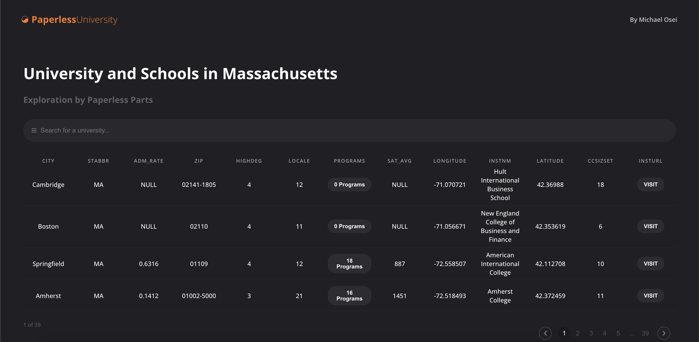
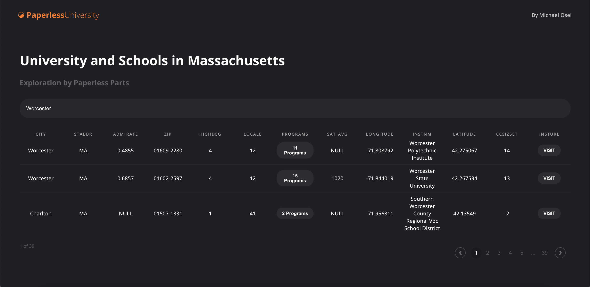
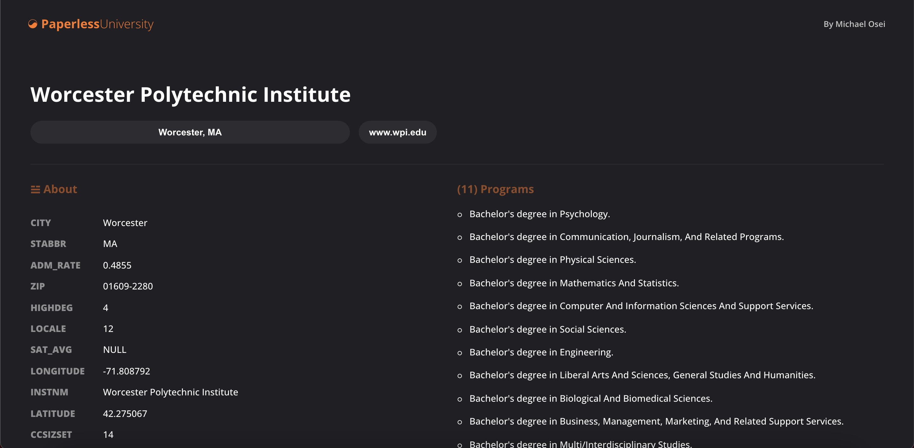

Takehome - Paperless University  
===

## Link
https://mike3osei.github.io/pap-university/#/

## Description 

The goal of this User Interface was to display relevant universities in the state of Massuchusetts. The main components impleneted here were Fuzzy Search based on Institutional Names, Dynamic Pagination, as well as a detailed information about each university and their programs. No external libraries were used. This application allows users to view a more detailed view of the university if they click on Programs. If they click on Visit that will take them to the univerisity's external site.

Special thanks to ReactJS, US Department of Education, HTML, CSS, and Git Pages

https://www.ed.gov/
https://pages.github.com/

Without you all this application would not be possible.

## Screenshots 
User Scenario which takes you through the navigating the home page, searching for Worcester Polytechnic Institute and viewing their specific programs

Every user has to start from somewhere :D

Fuzzy Search is implemented here to filter our large dataset

Here, we're showcasing everything there is about Worcester Polytechnic Institute

## Technical & Design • Achievements  

- ReactJS
- React-Router-Dom
- Manual Pagination
- Fulltext Search (Fuzzy Search)
- React Deployment to Gitpages
- HashRouter
- Dark Mode

## Future Enhancements  

- Advanced Search on any column
- Sorting in Big O(nlogn) time / QuickSort
- Map component, given latitutde and longitude
- Reduce state changes to optimize re-renders

## Deploy Locally

### `npm start`

Runs the app in the development mode.\
Open [http://localhost:3000](http://localhost:3000) to view it in the browser.

The page will reload if you make edits.\
You will also see any lint errors in the console.

